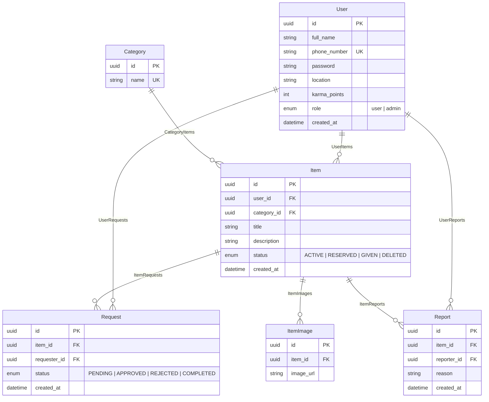

# ShareFlow — Community Item Sharing Ecosystem
### Product Specification & Design Requirements Document

ShareFlow is a premium, gamified peer-to-peer (P2P) resource-sharing platform. The platform connects community members, allowing them to list items they no longer need and request items shared by others. To encourage a culture of generosity, the platform implements a **Karma Points** reward system.

This document serves as the absolute source of truth for the database architecture, core business logic, and comprehensive user interface/experience (UI/UX) design specifications for both **Mobile** and **Web** applications.

---

## 1. Core Value Proposition
- 🌿 **Sustainability:** Reduce waste by keeping functional items in use within local communities.
- ❤️ **Gamified Altruism:** Givers are rewarded with **Karma Points** upon successful handovers, building community trust and prestige.
- 📍 **Hyper-Local Trust:** Location-based item discovery ensures transactions are nearby, convenient, and safe.
- 🤝 **Frictionless Handovers:** Structured request approvals protect user privacy (e.g., phone numbers are hidden until a request is approved).

---

## 2. Technical Blueprint (Database & Business Rules)

The system is built on a relational architecture (PostgreSQL via Prisma ORM) with strict status transitions and gamified hooks.

### Key Business Logic & State Machines
1. **User Authentication:** 
   - A unique **Phone Number** is used as the primary identifier (e.g., format: `+998901234567`).
   - Standard registration requires: `full_name`, `phone_number`, `password`, and `location`.
2. **Item Status Flow:**
   - **`ACTIVE`:** Listed and searchable by any community member.
   - **`RESERVED`:** An owner has accepted a user's request. The item is temporarily locked.
   - **`GIVEN`:** Handover complete. The item is removed from active discovery.
   - **`DELETED`:** Withdrawn by the owner.
3. **Request Lifecycle:**
   - Requesters can request any `ACTIVE` item (except their own). The request status starts as `PENDING`.
   - The owner is notified and reviews all pending requests.
   - The owner can **Approve** a request (`status: APPROVED`). This changes the item's status to `RESERVED` and **unveils** both parties' contact numbers to facilitate coordination.
   - The owner can **Reject** requests (`status: REJECTED`), which notifies the requesters.
   - Once the physical handover happens, the owner marks the request as `COMPLETED`.
4. **The Karma Engine:**
   - When a request is marked as `COMPLETED`, the owner’s `karma_points` are incremented by **`+10` points**.
   - Karma levels dictate user profile badges (e.g., `0-50` = "Seed Giver", `51-150` = "Community Supporter", `150+` = "Eco Hero").

---

## 3. UI/UX Design System Guidelines

To feel premium, modern, and state-of-the-art, the design should incorporate the following styling decisions:

*   **Color Palette (Nature & Trust):**
    *   *Primary (Emerald/Mint):* `hsl(150, 70%, 40%)` for positive actions, growth, and sharing.
    *   *Secondary (Warm Amber/Gold):* `hsl(40, 90%, 55%)` for Karma Points, achievements, and active statuses.
    *   *Base Dark:* `hsl(220, 20%, 10%)` and *Base Light:* `hsl(210, 30%, 98%)`.
    *   *Accent/Border:* Glassmorphism effect with thin semi-transparent white/gray borders (`rgba(255,255,255,0.08)` in dark mode).
*   **Typography:** Modern Sans-Serif (e.g., *Outfit* or *Inter* from Google Fonts).
*   **Aesthetics:** Smooth card elevations, deep gradients, modern blurred glass elements (`backdrop-filter: blur(16px)`), and tactile micro-animations on hover and clicks.

---

## 4. Epic Features & Pages to Design

The web and mobile applications require designing **8 major screens/flows**.

### Screen 1: Welcome, Authentication & Onboarding
*   **Objective:** Introduce the value proposition and handle secure onboarding.
*   **Visual Elements to Design:**
    *   A gorgeous introductory landing hero / splash screen illustrating sharing and karma impact.
    *   **Login Card:** Phone number and password inputs, with error tooltips.
    *   **Registration Card:** Multi-step wizard:
        *   *Step 1:* Basic credentials (Name, Phone, Password).
        *   *Step 2:* Location selection (an interactive search bar or geographic coordinate map picker integration).
    *   **Transitions:** Smooth slide animations between the Login and Register screens.

### Screen 2: Discovery Feed (The Community Catalog)
*   **Objective:** Allow users to browse, search, and discover available items.
*   **Visual Elements to Design:**
    *   **Top Bar:** Search input (with instantaneous matching) and a Location indicator showing the user's community scope.
    *   **Category Carousel:** Horizontal row of glassmorphic pills with unique custom icons representing categories (e.g., 🔌 Electronics, 👗 Clothes, 📚 Books, 🧸 Toys, 🏡 Household).
    *   **Item Feed:** Dynamic grid layout:
        *   *Item Cards:* Should show a high-quality product image, Category Badge, Title, distance/location tag, and the owner's miniature profile card with their current **Karma Tier Badge**.
    *   **Empty State:** A beautiful, custom graphic and illustration for "No active items in your neighborhood yet. Be the first to share!"
    *   **Loading State:** Smooth, animated CSS skeleton loading cards.

### Screen 3: Detailed Item View & Action Hub
*   **Objective:** Provide detailed item specs, seller credibility, and options to request or report.
*   **Visual Elements to Design:**
    *   **Media Gallery:** Rounded image carousel showing multiple uploads with slider indicator dots.
    *   **Item Info Block:** Large title, creation timestamp (e.g., "Listed 2 hours ago"), a prominent green status badge (`ACTIVE`, `RESERVED`, or `GIVEN`), and the text description.
    *   **Giver Credibility Card:** Displays owner's name, profile photo, verified location, and an animated radial tracker for their **Karma Level** (e.g., "⭐ 80 Karma Points — Community Supporter").
    *   **The Main Interaction Call-to-Action (CTA):**
        *   *If visitor:* A dominant, animated "Request This Item" button. Once tapped, it morphs into a glowing "Request Sent" pending state.
        *   *If owner:* A primary action drawer with options to "Manage Incoming Requests (Count: 3)" and "Edit Listing Details".
        *   *If already requested:* A secondary state indicating the request status (e.g., `APPROVED - Tap to Call Giver`).
    *   **Report Button:** Subtle red flag icon in the corner that triggers the **Report Dialog** (Screen 8).

### Screen 4: "Share an Item" Creation Wizard
*   **Objective:** A seamless, friction-free listing process to encourage donations.
*   **Visual Elements to Design:**
    *   **Step 1: Multi-Image Uploader:** A beautiful, dotted drag-and-drop boundary box (or camera capture layout for mobile). Show listable slots with dynamic preview thumbnails, progress indicators, and an easy delete `(X)` icon on each image.
    *   **Step 2: Core Details Form:** Text fields for Title (with recommended character limits) and Description (with auto-expanding textbox), plus a dropdown for Categories.
    *   **Step 3: Location Confirmation:** Prefilled from user profile location, with a toggle to use a custom location for this specific listing.
    *   **Submit Button:** Features a loading state which transforms into a full-screen **Karma Celebration Modal** featuring floating green leaves and positive reinforcement: *"Thank you for giving back! Your listing is now live."*

### Screen 5: Manage Listings & Requests Dashboard (The Hub)
*   **Objective:** An organized space for users to manage the lifecycle of their listings and incoming inquiries.
*   **Visual Elements to Design:**
    *   **Listing Tabs:** "My Shares" vs. "My Requests".
    *   **My Shares Grid:** Cards showing the owner's listed items. Each card displays:
        *   Item Thumbnail, Title, and status.
        *   A notification pill highlighting the number of pending requester applications.
    *   **Incoming Requests Drawer (Expanded View):**
        *   Clicking a listing reveals a sidebar/drawer containing the list of active applicants.
        *   *Applicant Cards:* Shows the applicant's avatar, name, location, joining date, and **Karma Points**.
        *   *Action Controls:* Distinct green "Accept / Reserve" and red "Politely Decline" icons.
        *   *The Handover Action:* For accepted applicants, displays a prominent button: **"Complete Handover"**.

### Screen 6: The Handover & Karma Reward Screen
*   **Objective:** Reward altruistic behavior with premium visual feedback upon transaction completion.
*   **Visual Elements to Design:**
    *   Triggered when the owner taps "Complete Handover".
    *   An elegant popup overlay showing the congratulations message.
    *   An animated counter that ticks upwards: `[Current Karma Points] -> [+10] -> [New Karma Points]`.
    *   A progress ring displaying how close the user is to the next **Karma Level** (e.g., "20 points left to unlock 'Eco Hero' badge!").
    *   Social share options to post their community impact metrics.

### Screen 7: Profile & Gamified Impact Center
*   **Objective:** Display user statistics, manage profile details, and review achievements.
*   **Visual Elements to Design:**
    *   **Avatar & Header:** Big profile picture, full name, location badge, and "Member since" timestamp.
    *   **Impact Grid:** Numeric tiles displaying:
        *   `Total Karma Points`
        *   `Items Shared`
        *   `Items Received`
        *   `Active Requests`
    *   **Achievements Locker:** A gallery of visual badges that are colored when unlocked and greyscale when locked (e.g., "First Gift", "Category Expert", "Neighbor of the Month").
    *   **Settings Form:** Smooth fields to update full name, location, and phone number with password change controls.

### Screen 8: Safety & Moderation Flow (Report Modal)
*   **Objective:** Maintain a safe community by enabling fast reporting.
*   **Visual Elements to Design:**
    *   A dark-tinted overlay modal presenting a checklist of report reasons (e.g., "Commercial/Not Free", "Broken/Hazardous", "Inappropriate Behavior/Language", "Scam/Spam").
    *   An optional text area for custom notes or context.
    *   A warning alert reminding the user that false reports are subject to review.
    *   A clean "Submit Report" button which closes with a polite confirmation toast.

---

## 5. Mobile vs. Web UX Adaptations

| Platform | Screen Layout | Specific Interactions to Design |
| :--- | :--- | :--- |
| **Mobile App (iOS / Android)** | Single column, thumb-friendly navigation. Fixed bottom tab bar. | Swipe-to-dismiss requests, pinch-to-zoom on images, tap-to-call integrations, camera shutter interactions. |
| **Web App (Desktop)** | Multi-column layouts (e.g., Item Feed + Map Sidebar side-by-side). Sticky top navigation header. | Hover-to-zoom thumbnails, keyboard shortcut indicators, drag-and-drop image uploads, responsive layout grids. |

---

### Instructions for Design & Application Generators
*   Maintain a modern **rounded corner radius** of `12px` to `16px` across all card interfaces.
*   Use HSL tailored palettes with dark modes to establish high visual contrast and vibrant emerald/mint details.
*   Ensure that every state transition (such as clicking 'Approve Request' or 'Complete Handover') features smooth CSS hover, scale, and active animations.
